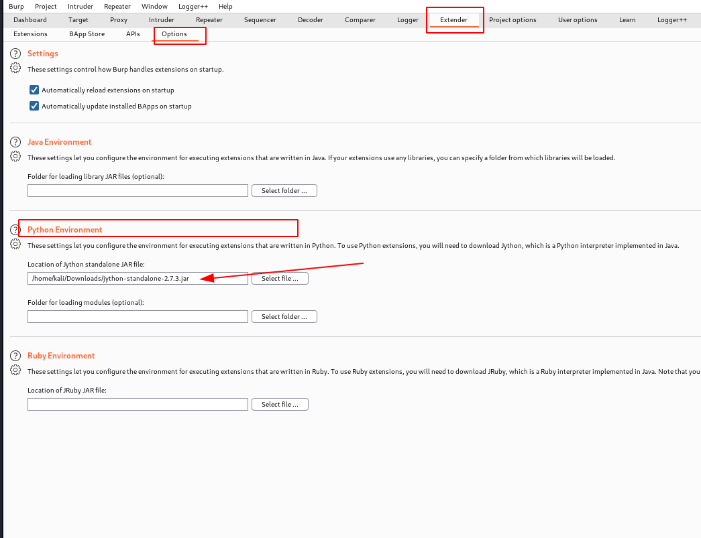
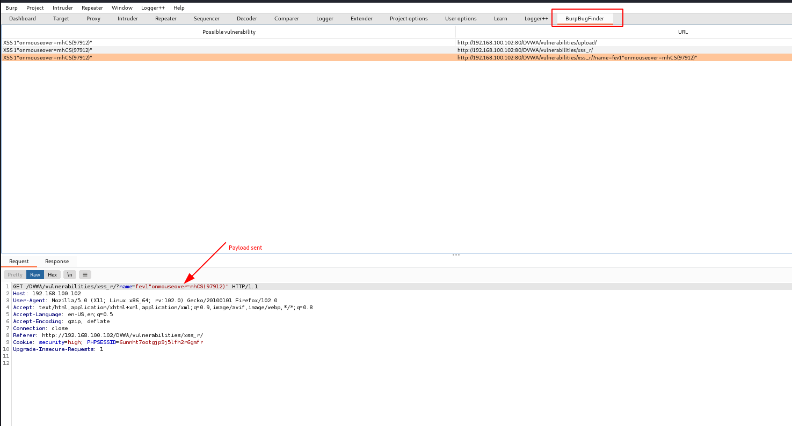
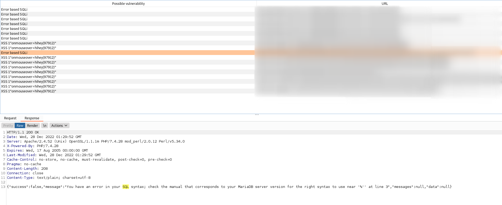

# burp_bug_finder

Burp_bug_finder is a custom burpuite plugin (written in python) that makes easy the discovery of web vulnerabilities. 
This version focuses only on XSS, and error based SQLi **there's no need to manually send xss payload either for reflected or stored payload**; you just need to browse to the pages where you want to check XSS vulnerability or error based SQL injection.

# How to install
1. Install jython and include it in the extender tab. 
The lastest version (2.7.3) at today date can be downloaded here https://repo1.maven.org/maven2/org/python/jython-standalone/2.7.3/jython-standalone-2.7.3.jar

2. Include the jython in the python environment in Extender > Options > Python Environment 

3. Download the burp_bug_finder.py from this repository and include it the the extension.

# How it works 

burp_bug_finder captures all requests sent through the proxy and resend them by modifiying every parameter (including cookie) with XSS and SQLi payloads.
The XSS payload and SQL error message are then checked in the response of the request.

If the payload pattern is found in the response, a log is added in the tab named BurpBugFinder.

**NB:** Since every request sent is tweaked, kindly enable the extension only when you want to check for bug.

# References
- https://portswigger.net/burp/extender#SampleExtensions
- https://gist.github.com/irsdl/0ab8fce5368e449df64ed89c1b7323a6
- https://cirius.medium.com/writing-your-own-burpsuite-extensions-complete-guide-cb7aba4dbceb
